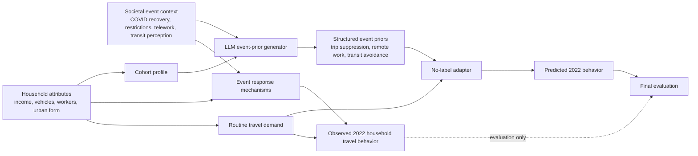

# Causal Guardrail Design

## Purpose

This project should use causal language only as a guardrail, not as a causal-effect claim.

Allowed framing:

> LLM priors are structured mechanism proxies for post-pandemic event response.

Not allowed framing:

> LLM priors identify the causal effect of COVID-19 on household travel.

## Causal DAG

## Interpretation

- `H -> R`: traditional supervised learning captures stable household heterogeneity.
- `E -> M -> Y`: the pandemic recovery changes the behavioral mechanism.
- `H -> M`: event response is heterogeneous across households.
- `E, P -> L -> S`: the LLM converts external event context and household cohort profiles into structured event priors.
- `S -> A`: the adapter uses priors through pre-declared correction rules.
- `Y` should not enter `L` or `A` during training/calibration.

## Negative Controls

Already available:

- Random pressure assignment.
- Global pressure baseline.
- Temporal transfer validation.

Add next:

- Irrelevant pseudo-event prior:
  - Ask/generate an event prior unrelated to travel suppression, such as generic “digital service adoption pressure,” and verify it should not improve trip-count prediction.
- Pre-COVID placebo:
  - Apply the event-adaptation logic to a pre-COVID target year where no pandemic mechanism exists.
- Feature leakage audit:
  - Assert no target, survey weight, household ID, or post-outcome aggregate target statistic is included in LLM prompts.

## Claim Discipline

| Phrase | Use? | Reason |
|---|---|---|
| causal guardrails | Yes | Describes audit logic |
| mechanism proxy | Yes | Accurate for LLM priors |
| causal plausibility | Yes | Properly scoped |
| causal effect | No | Not identified |
| treatment effect | No | No formal treatment assignment |
| confounding-aware diagnostic | Yes, if explained | We use controls/placebos, not full identification |

## PPT Integration

Best location:

- After the technical route slide if causal guardrails are emphasized.
- Or as a backup slide after robustness.

Spoken message:

> “We use causal structure as a guardrail: target labels do not enter the LLM branch, and negative controls test whether the event prior behaves like a meaningful mechanism rather than arbitrary prompt noise.”
